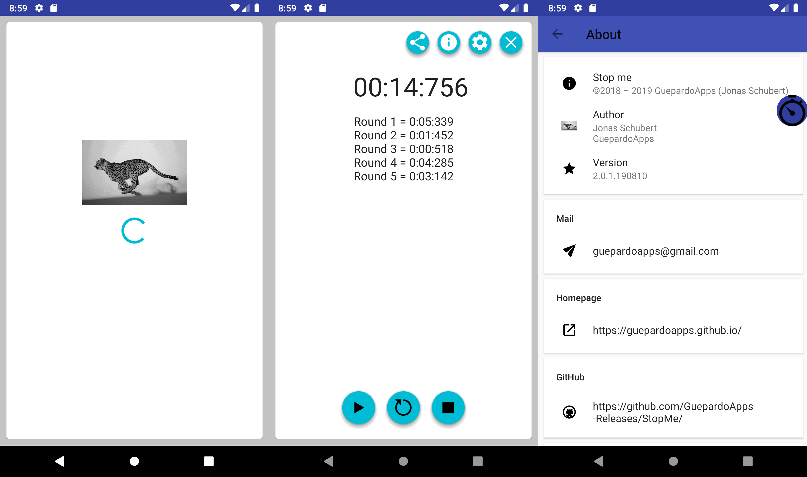

# StopMe - development branch

Android application for tracking time.
Example of a floating window and floating button to track time anywhere.

## Screenshots

___________________________________

## License

StopMe is distributed under the MIT license. [See LICENSE](LICENSE.md) for details.